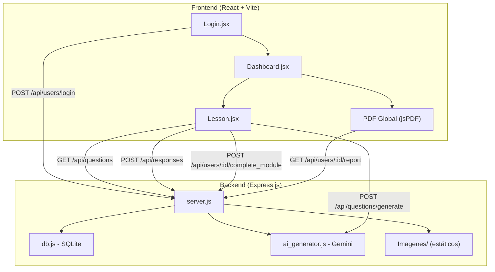
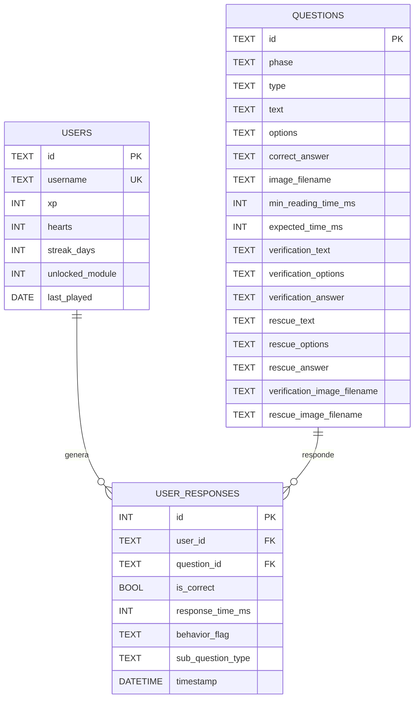
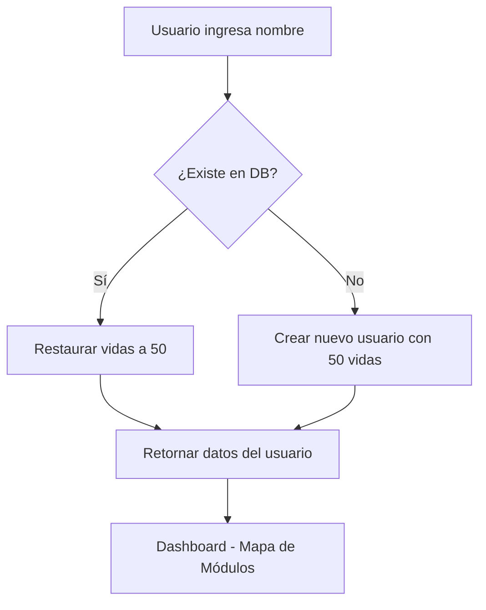
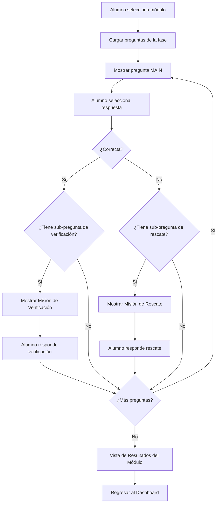

# Búhotech Labs — Modelo Birdbrain
## Documentación Técnica del Sistema

> **USMP - Virtual** | Plataforma Gamificada de Aprendizaje de Metodología de la Investigación potenciada con IA
> **Estado del Proyecto**: 🟢 DESPLEGADO EN PRODUCCIÓN (Railway)

---

## 1. Visión General del Proyecto

**Búhotech Labs - modelo Birdbrain** es una aplicación web interactiva diseñada para enseñar **Metodología de la Investigación Científica** a estudiantes universitarios de la USMP. Inspirada en la mecánica de Duolingo, transforma conceptos académicos en misiones gamificadas con:

- **Ramificaciones adaptativas** (verificación/rescate) según el desempeño del alumno.
- **Generación de contenido con IA** (Google Gemini) como respaldo pedagógico.
- **Informe global calificado** (PDF descargable) al completar todas las fases.

---

## 2. Arquitectura del Sistema



### Stack Tecnológico

| Capa | Tecnología | Propósito |
|------|-----------|-----------|
| Frontend | React 18, Vite, Tailwind CSS 4 | Interfaz de usuario SPA |
| Backend | Express.js, Node.js | API REST |
| Base de Datos | SQLite (better-sqlite3) | Almacenamiento local persistente |
| IA Generativa | Google Gemini 2.5 Flash | Generación dinámica de preguntas |
| PDF | jsPDF | Generación de informes del lado del cliente |
| Audio | Web Audio API + SpeechSynthesis | Efectos sonoros y lectura TTS |

---

## 3. Estructura de Archivos

```
antigravity-webapp/
├── client/                          # Frontend React
│   ├── src/
│   │   ├── App.jsx                  # Router principal (Login → Dashboard → Lesson)
│   │   ├── index.css                # Design system (Tailwind + custom tokens)
│   │   └── components/
│   │       ├── Login.jsx            # Pantalla de acceso (USMP + Búhotech branding)
│   │       ├── Dashboard.jsx        # Mapa de módulos + PDF global
│   │       └── Lesson.jsx           # Motor de lecciones gamificadas
│   └── package.json
├── server/                          # Backend Express
│   ├── server.js                    # API endpoints
│   ├── db.js                        # Esquema SQLite
│   ├── seed.js                      # Datos iniciales (preguntas por fase)
│   ├── ai_generator.js              # Integración Google Gemini
│   ├── .env                         # Variables de entorno (GEMINI_API_KEY)
│   └── package.json
└── Imagenes/                        # Assets visuales (Buhotech-*.png)
```

---

## 4. Modelo de Datos (SQLite)



### Descripción de Tablas

| Tabla | Descripción |
|-------|-------------|
| `users` | Perfil del alumno: XP, vidas, racha, módulo desbloqueado |
| `questions` | Banco de preguntas con estructura ramificada (main → verification / rescue) |
| `user_responses` | Registro de cada respuesta con métricas de tiempo y comportamiento |

---

## 5. Lógica de Procesos

### 5.1 Flujo de Autenticación



### 5.2 Flujo de Lección Gamificada (Motor Principal)



### 5.3 Sistema de Comportamiento Adaptativo

Cada respuesta se clasifica automáticamente:

| Comportamiento | Condición | Consecuencia |
|---------------|-----------|-------------|
| `FAST_RANDOM` | `response_time < min_reading_time` | Se penaliza con -1 corazón. Alerta visual de azar. |
| `NORMAL` | Dentro del rango esperado | Si acierta: +10 XP. Si falla: -1 corazón. |
| `SEARCHING_THINKING` | `response_time > expected_time` | Si acierta: +10 XP + badge "🧠 Pensaste bien". |

### 5.4 Sistema de Calificación Vigesimal

La nota se calcula al generar el informe PDF global:

```
Nota = 10 + (aciertos / total_misiones) × 10
```

| Resultado | Nota | Color |
|-----------|------|-------|
| 100% aciertos | 20/20 | 🟢 Verde |
| 50% aciertos | 15/20 | 🟢 Verde |
| 40% aciertos | 14/20 | 🟢 Verde (aprobado) |
| 30% aciertos | 13/20 | 🔴 Rojo (desaprobado) |
| 0% aciertos | 10/20 | 🔴 Rojo |

> [!IMPORTANT]
> La nota mínima posible es **10** y la máxima es **20**, conforme al sistema vigesimal peruano.

---

## 6. API REST — Endpoints

| Método | Ruta | Descripción |
|--------|------|-------------|
| `POST` | `/api/users/login` | Login o registro automático |
| `GET` | `/api/users/:id` | Obtener perfil del usuario |
| `POST` | `/api/users/:id/complete_module` | Desbloquear siguiente módulo |
| `GET` | `/api/users/:id/report` | Obtener historial completo para PDF |
| `GET` | `/api/questions?phase=X` | Obtener preguntas por fase |
| `POST` | `/api/responses` | Registrar respuesta + métricas |
| `POST` | `/api/questions/generate` | Generar preguntas con IA (Gemini) |

### Archivos estáticos
| Ruta | Contenido |
|------|-----------|
| `/images/*` | Imágenes Buhotech (servidas desde `Imagenes/`) |

---

## 7. Componentes del Frontend

### 7.1 [Login.jsx](file:///c:/Users/Renato%20Bertolotti/OneDrive%20-%20Universidad%20de%20San%20Martin%20de%20Porres/antigravity-webapp/client/src/components/Login.jsx)
- Branding institucional: **USMP - Virtual** (rojo) + logo Búhotech + subtítulo "modelo Birdbrain".
- Campo de texto para el nombre del alumno ("detective").
- POST a `/api/users/login` para crear o recuperar sesión.

### 7.2 [Dashboard.jsx](file:///c:/Users/Renato%20Bertolotti/OneDrive%20-%20Universidad%20de%20San%20Martin%20de%20Porres/antigravity-webapp/client/src/components/Dashboard.jsx)
- Muestra estadísticas: Vidas (❤), Racha (🔥), XP (🛡).
- **Mapa de Módulos**: 5 fases con progresión visual (bloqueado/actual/completado).
- **Informe Global**: Botón "🎓 DESCARGAR INFORME GENERAL" que aparece solo cuando `unlocked_module > 5`.
  - Consulta `GET /api/users/:id/report` para obtener todo el historial.
  - Genera PDF con jsPDF agrupado por fase con nota vigesimal.

### 7.3 [Lesson.jsx](file:///c:/Users/Renato%20Bertolotti/OneDrive%20-%20Universidad%20de%20San%20Martin%20de%20Porres/antigravity-webapp/client/src/components/Lesson.jsx) (Motor Principal)
- **Tarjeta de pregunta**: Imagen contextual + texto + opciones A/B.
- **Audio**: Botón 🔊 para escuchar la pregunta (Web Speech API).
- **Efectos sonoros**: Web Audio API (arpegio de éxito, barrido de error, pop de selección).
- **Ramificaciones**: Misión de Verificación (si acierta) / Misión de Rescate (si falla).
- **Vista de Resultados**: Al terminar, muestra nota del módulo, historial ✓/✗, XP y corazones.
- **Generación IA**: Botón "✨ GENERAR CON IA" si no hay preguntas disponibles.

---

## 8. Módulos Pedagógicos (Fases)

| # | Fase | Tema |
|---|------|------|
| 1 | Los Archivos de la Humanidad | Ciencia, conocimiento científico, enfoques |
| 2 | El Mapa del Detective | Objetivos, preguntas, marco teórico, justificación |
| 3 | Las Lentes del Investigador | Enfoques cualitativo/cuantitativo, diseños narrativo, etnográfico |
| 4 | La Sospecha y el Campo | Hipótesis, variables, diseños experimentales, muestreo |
| 5 | El Jefe Final | Integración de todos los conceptos anteriores |

---

## 9. Estado del Proyecto

### Funcionalidades Completadas ✅

- [x] Login y gestión de usuarios con restauración automática de vidas
- [x] 5 fases pedagógicas con banco de preguntas ramificadas
- [x] Motor de lecciones con mecánica Duolingo (misiones de Verificación y Rescate)
- [x] Sistema de comportamiento adaptativo (detección de azar, pensamiento, normalidad)
- [x] Mascota Búhotech con burbujas de diálogo y animaciones
- [x] Efectos sonoros premium (Web Audio API)
- [x] Text-to-Speech (lectura de preguntas en español)
- [x] Imágenes dinámicas por subpregunta (verificación/rescate)
- [x] Branding institucional USMP y Búhotech Labs
- [x] Generación dinámica de preguntas con IA (Google Gemini 2.5 Flash)
- [x] Vista de Resultados por módulo (nota, historial, XP)
- [x] Informe General PDF (nota vigesimal 10-20) desbloqueado al completar las 5 fases

### Pendientes / Mejoras Futuras 🔲

- [x] Deploy a producción (Railway) con dominio SSL
- [ ] Autenticación con credenciales institucionales (LDAP / SSO USMP)
- [ ] Panel de administración para docentes
- [ ] Estadísticas agregadas por aula/sección
- [ ] Temporizador visible por pregunta
- [ ] Leaderboard entre alumnos
- [ ] Modo oscuro

---

## 10. Instrucciones de Ejecución

### Requisitos Previos
- Node.js v18+
- npm

### Instalación

```bash
# Backend
cd server
npm install
node seed.js          # Crear y poblar la base de datos

# Frontend
cd ../client
npm install
```

### Ejecución Local

```bash
# Terminal 1 — Backend (puerto 3001)
cd server
node server.js

# Terminal 2 — Frontend (puerto 5173)
cd client
npm run dev
```

### Despliegue en la Nube (Railway)
- **URL**: [https://buhotech-labs-production-bf0e.up.railway.app](https://buhotech-labs-production-bf0e.up.railway.app)
- **Node Version**: 20.x
- **Port**: 8080 (asignado por Railway)
- **Instalación Automática**: El script `build` raíz ejecuta `npm install` en todas las subcarpetas.
- **Base de Datos**: Auto-seeding activado si la tabla `questions` está vacía.

### Variables de Entorno

Crear archivo [server/.env](file:///c:/Users/Renato%20Bertolotti/OneDrive%20-%20Universidad%20de%20San%20Martin%20de%20Porres/antigravity-webapp/server/.env):
```
GEMINI_API_KEY=tu_clave_de_google_gemini
```

> [!NOTE]
> Sin la API Key, el sistema funciona normalmente con las preguntas pre-cargadas. La IA solo se activa como respaldo cuando una fase no tiene preguntas en la base de datos.

---

## 11. Dependencias Principales

### Backend ([server/package.json](file:///c:/Users/Renato%20Bertolotti/OneDrive%20-%20Universidad%20de%20San%20Martin%20de%20Porres/antigravity-webapp/server/package.json))
| Paquete | Versión | Uso |
|---------|---------|-----|
| express | ^4.x | Servidor HTTP y API REST |
| better-sqlite3 | ^11.x | Motor de base de datos embebido |
| cors | ^2.x | Habilitación de CORS |
| dotenv | ^16.x | Variables de entorno |
| @google/generative-ai | ^0.x | SDK de Google Gemini |

### Frontend ([client/package.json](file:///c:/Users/Renato%20Bertolotti/OneDrive%20-%20Universidad%20de%20San%20Martin%20de%20Porres/antigravity-webapp/client/package.json))
| Paquete | Versión | Uso |
|---------|---------|-----|
| react | ^18.x | Librería de UI |
| vite | ^6.x | Bundler y servidor de desarrollo |
| axios | ^1.x | Cliente HTTP |
| lucide-react | ^0.x | Iconografía SVG |
| jspdf | ^2.x | Generación de PDF en el navegador |
| tailwindcss | ^4.x | Framework de estilos utilitarios |
